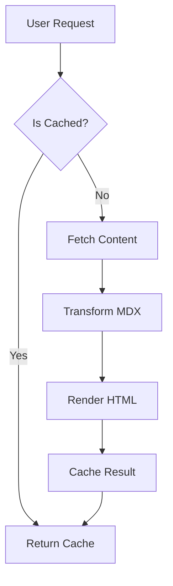
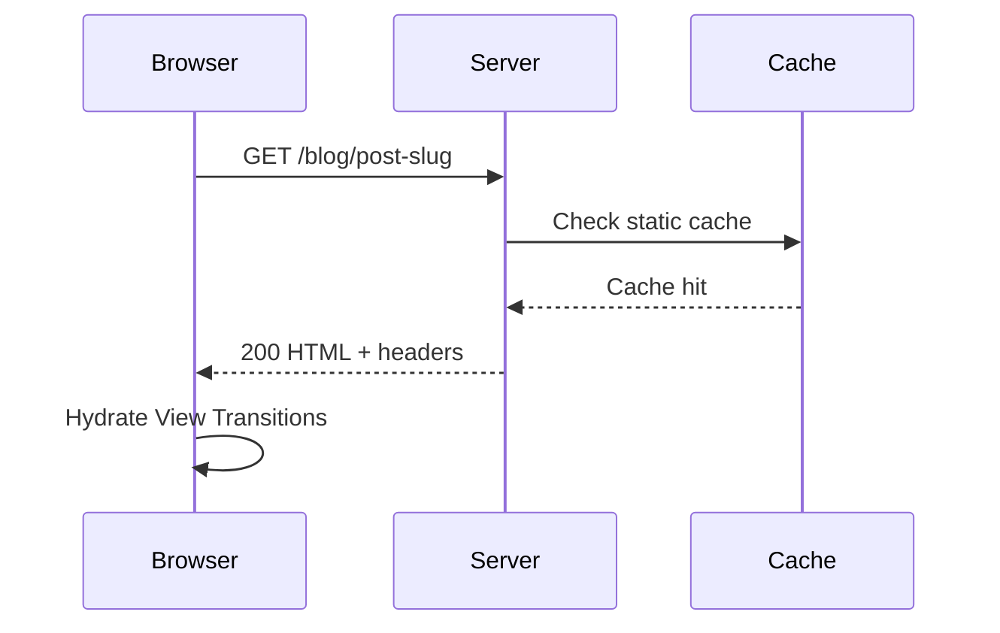

import LiteYouTube from "../../../components/LiteYouTube.astro";
import Figure from "../../../components/Figure.astro";
import Table from "../../../components/Table.astro";
import TwitterCard from "../../../components/TwitterCard.astro";

Writing for this digital library is an exercise in intentionality. Every element in this design system—from the width of a character to the physics of a link—has been calibrated to honor the act of reading.

This post operates as a living document. It exists to demonstrate and catalog *every* typographic element, interactive component, and content pattern supported by this blog. Think of it as both a philosophical style guide and an exhaustive stress test—a single artifact where every building block appears at least once, in context.

## Prose and Paragraph Text

The soul of this site is the **Merriweather** serif. It was chosen for its generous x-height and sturdy counters, which provide a comfortable, grounded reading experience even during long reading sessions. Paragraphs flow with a relaxed `1.6` line height, automatic hyphenation, and hanging punctuation.

When you write body text here, you are participating in a **24px vertical rhythm**. This means that the spacing between blocks snaps to a hidden grid, ensuring a consistent cadence regardless of what elements appear in sequence.

**Guidance**: Prose is your primary vehicle for synthesis. Use it to weave your arguments. The text wraps using the `pretty` algorithm, which mathematically prevents orphaned words at the ends of paragraphs. Long-form prose should feel unhurried—an experience akin to a well-typeset journal rather than a digital feed.

## Inline Formatting

Standard inline elements are your primary tools for nuance and emphasis within a sentence:

- Use **bold text** for strong declarations or to highlight key terms.
- Use *italic text* for softer stress, book titles, or foreign words.
- Use `inline code` for technical precision, such as referring to `src/utils/content.ts` or `useState`.

You can freely weave these together—***bold italic*** works perfectly—or use them for technical asides. Superscript, for instance, appears automatically in footnote references[^1] and can be used for mathematical notations like E=mc².

## The Architecture of Hierarchy

Titles and headings are not simply decorations; they are the milestones of your thought process. This system uses a **Major Third (1.25)** ratio for its typographic scale. This means an `h1` is exactly 1.25 times larger than an `h2`, which is 1.25 times larger than an `h3`. Headings at `h2` and `h3` receive automatic anchor links on hover, enabling deep-linking to any section.

### Third-Level Heading

**The What and When**: Use `h3` for subsections within a major topic. The Table of Contents sidebar (visible on wide screens) tracks both `h2` and `h3` entries, making this your primary tool for breaking down complex arguments.

#### Fourth-Level Heading

**The What and When**: Use `h4` sparingly. It sits below the TOC threshold but provides necessary structural hierarchy for dense technical documentation or granular breakdowns.

**Hierarchy Rule**: Never skip heading levels. An `h3` must always be preceded by an `h2`. This maintains structural integrity for the Table of Contents, respects the typographic rhythm, and satisfies accessibility requirements for screen readers.

## Interaction and Presence

We believe that digital elements should have a sense of physical weight and responsiveness.

### Links

Links are more than just pointers; they are invitations to explore. In this system, links lift slightly when hovered, simulating a physical interaction as if the text is rising from the substrate.

- **Internal Links**: Here is an `<Link href="/">example internal link</Link>`. Use them to connect thoughts across this vault. They prefetch content automatically to make transitions feel instantaneous.
- **External Links**: Here is an `<Link href="https://astro.build">external link example</Link>`. Use these for citations and references. They automatically open in a new tab with `rel="noopener noreferrer"`, signaling that the reader is momentarily stepping away from your library.

## Structural Elements

### Blockquotes

A blockquote is a moment of deference. Use it when quoting other authors or when you need to pull a particularly important thought out of the primary flow. Blockquotes carry subtle letter-spacing for visual distinction.

> "The organization of information is a design problem. Like all design problems, it has no single correct solution—only solutions that are more or less appropriate for a given context, audience, and purpose."

A blockquote can comfortably span multiple paragraphs without losing its structural integrity:

> Architecture is the thoughtful making of space. It is not about the conditions of design so much as the design of conditions.
> 
> Every building tells the story of the constraints that shaped it—gravity, budget, client, climate, code. The architect's job is to make those constraints sing.

### Organizing Information (Lists)

Lists provide scannability, helping readers digest complex sets of information quickly.

#### Unordered Lists

Use these for groups of related facts where the order is irrelevant. The custom em-dash marker (—) in the primary accent color is designed to be less intrusive than a traditional bullet, maintaining the horizontal flow of the line.

- Information architecture concerns the structural design of shared environments.
- It is the art and science of organizing websites, intranets, and software.
- The goal is to help users find information and complete tasks.

#### Ordered Lists

Necessary for sequences, steps, or rankings. The tabular numbers ensure that multi-digit lists align perfectly, respecting the vertical rhythm.

1. Define the problem space and user needs.
2. Conduct a content inventory and audit.
3. Develop a taxonomy and controlled vocabulary.
4. Create wireframes and navigation structures.

#### Nested Lists

Lists can nest to communicate sub-hierarchies seamlessly:

- Global navigation patterns
- Header utilities
- Footer sitemaps
- Local navigation within sections
- Contextual cross-links between related content

#### Task Lists

GitHub-flavored task lists render as custom-styled checkboxes. Use these to show progress, signaling to the reader that a process is underway or incomplete:

- [x] Set up the content schema with Zod validation.
- [x] Implement the design token system in OKLCH.
- [ ] Add responsive image pipeline.
- [ ] Write comprehensive end-to-end tests.

### Definition Lists

When defining terms or glossary items, definition lists provide a beautiful semantic structure:

`<dl>...</dl>`

## Tabular Data & Comparison

When information is better understood through comparative analysis, use a **Table**. Tables provide a structured grid for multi-dimensional data, perfect for pricing, feature lists, or dense comparisons.

### Markdown Tables

For simple, quick comparisons, standard markdown tables are auto-wrapped for horizontal scrolling on small screens:

| Principle | Description | Example |
| --- | --- | --- |
| Findability | Users can locate what they need | Clear navigation, search |
| Accessibility | Content is usable by everyone | Semantic HTML, ARIA |
| Clarity | Information is unambiguous | Plain language, labels |

### Component Tables with Captions

The `<Table>` component adds structured labelling via `label` and `caption` props, ideal for formal references.

`<Table label="TABLE 1" caption="Comparison of font stacks used across the design system, showing each variable name, its typeface, and primary usage context.">...</Table>`

## Beyond the Sentence: Narrative Breaks

Horizontal rules create a thematic break between major sections.

---

**Use Case**: Use the rule above to provide breathing room between unrelated blocks of content, or to mark a transition where a new heading would feel over-prescriptive and too heavy.

## Rich Media & Technical Context

Media should support the prose, never distract from it. Everything from images to diagrams comes with specific loading and rendering strategies.

### Images and Figures

Every image should be wrapped in a `<Figure>`. This ensures it receives proper attribution, enforces explicit `width` and `height` for Cumulative Layout Shift (CLS) prevention, and applies our custom physical styling—rounded corners, a subtle inset border, and an embedded shadow.

<Figure src="https://images.unsplash.com/photo-1481627834876-b7833e8f5570?w=800&h=450&fit=crop" alt="Rows of books on wooden library shelves, warm ambient lighting" width={800} height={450} label="FIG. 1" caption="The organizational challenge of any library mirrors the challenge of any information system: how to make the right content findable at the right moment." />

Figures can also stand alone seamlessly without a caption or label when the image itself is the primary content:

<Figure src="https://images.unsplash.com/photo-1507842217343-583bb7270b66?w=800&h=400&fit=crop" alt="An open book on a reading desk with natural light" width={800} height={400} />

### Video Embeds

The `<LiteYouTube>` component renders a lightweight facade that only loads the full YouTube iframe on click.

**The Why and When**: This saves roughly 800 KiB of initial payload and uses `youtube-nocookie.com` for privacy. Use it when motion or sound is critical to the explanation, without punishing the reader's bandwidth.

<LiteYouTube videoId="dQw4w9WgXcQ" title="Rick Astley - Never Gonna Give You Up" />

### Embedded Tweets

The `<TwitterCard>` component renders a static snapshot of a tweet, fetched at build time. It avoids loading Twitter's JavaScript entirely, preserving performance and privacy.

**The Why and When**: Use this when referencing a public statement, opinion, or announcement that adds authority or context to your argument. The card is styled to feel native to the page rather than injected from a foreign design system.

<TwitterCard id="20" />

### Technical Demonstrations (Code Blocks)

For technical posts, code blocks are essential. Fenced code blocks receive syntax highlighting via **Shiki** with dual themes (light and dark), a floating language label, and a copy button.

#### JavaScript

```javascript
function fibonacci(n) {
  if (n <= 1) return n;
  let prev = 0;
  let curr = 1;
  for (let i = 2; i <= n; i++) {
    [prev, curr] = [curr, prev + curr];
  }
  return curr;
}
```

#### TypeScript

```typescript
interface ContentEntry {
  title: string;
  summary: string;
  tags: string[];
  date: Date;
}
```

#### CSS

```css
.content {
  font-family: var(--font-serif);
  line-height: var(--line-height-relaxed);
  font-variant-numeric: oldstyle-nums proportional-nums;
}
```

#### HTML

```html
<figure>
  
</figure>
```

#### Shell Commands

```bash
bun run build && bun run check
```

#### JSON

```json
{
  "name": "fpl0.blog",
  "type": "module"
}
```

#### Plain Text

```
No syntax highlighting here.
Just plain monospaced text in a code block.
Useful for logs, output, or pseudocode.
```

### Mermaid Diagrams

Diagrams written in mermaid syntax are pre-rendered at build time into beautiful dual-theme SVGs (light and dark), with zero client-side JavaScript. A toggle button lets readers view the source code.

**The Why and When**: Use these to explain logic flows, system architectures, or sequence of events. They ensure technical diagrams feel as sharp and perfectly integrated as the surrounding text.

#### Flowchart



#### Sequence Diagram



### Collapsible Sections

The `<details>` element creates expandable sections with a custom toggle indicator and a smooth fade-in animation.

**The Why and When**: Use collapsibles for supplemental information that might overwhelm the primary narrative—like technical specifications or deep-dives that only a subset of readers will need.

<details>
<summary>Frontmatter Fields</summary>

Every blog post requires these fields in its YAML frontmatter:

- **title** — The post title displayed in the header and metadata.
- **summary** — A 50–360 character description for feeds and SEO.
- **createdDate** — The date the post was first drafted.

</details>

<details>
<summary>Design Tokens Architecture</summary>

The entire visual language is derived from a mathematical engine in `global.css`:

1. **Spacing** uses a 4px base grid.
2. **Typography** follows a Major Third (1.25) ratio for the heading scale.
3. **Color** lives entirely in the OKLCH perceptual space for uniform luminance steps.

</details>

## The Edge of the Page: Footnotes

Footnotes use GitHub Flavored Markdown syntax. Reference marks appear as superscript numbers in the primary accent color[^2], and the footnote content collects at the bottom of the post in a dedicated section.

**Guidance**: Use footnotes[^2] for citations or asides that would otherwise clutter the main argument. They provide a "layer" of depth for the curious reader without blocking the path for casual readers. Multiple footnotes accumulate naturally[^3].

## Combining Elements

Real posts rarely use elements in isolation. Here is a passage that weaves several together to prove the robustness of the system:

The fundamental theorem of information architecture—that **every classification scheme embodies a worldview**—has practical consequences for anyone building a content system. Consider a blog with two content types: posts and apps. The shared schema[^2] ensures consistent date handling:

```typescript
const baseFields = {
  title: z.string(),
  summary: z.string().min(50).max(360),
  isDraft: z.boolean().default(true),
};
```

Both collections consume these fields, but each extends them differently. The blog adds `author` and `image`; the apps collection auto-injects an `"app"` tag. This pattern is a direct application of the `<Link href="https://en.wikipedia.org/wiki/Open%E2%80%93closed_principle">Open-Closed Principle</Link>` to content modeling.

---

## Final Thoughts on Tone

Write with precision. This library is a place for deep thought and clear communication. Avoid the "digital noise" of the modern web. Keep your sentences intentional, your hierarchy logical, and your media purposeful.

If an element renders on this page, it is part of our shared vocabulary. Use it wisely.

[^1]: This is the first footnote, referenced earlier in the inline formatting section. Footnotes support **bold**, *italic*, and `inline code`.

[^2]: They are particularly useful for citations or providing extra context.

[^3]: The footnote section appears after all body content, separated by a thin top border. Each entry is numbered with a custom counter in the monospace brand font. The back-reference arrow uses a clean typography character.

