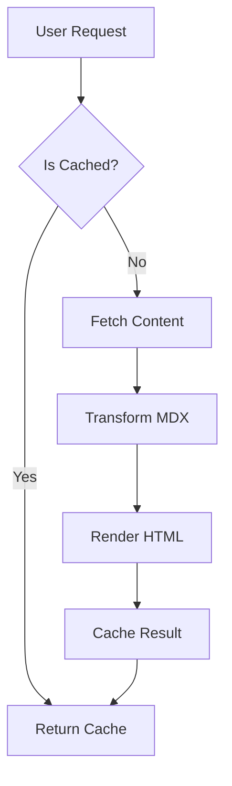
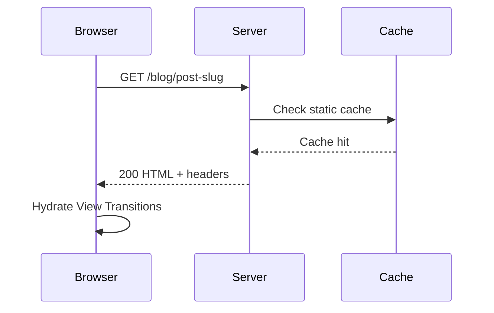

import LiteYouTube from "../../../components/LiteYouTube.astro";
import Figure from "../../../components/Figure.astro";
import Table from "../../../components/Table.astro";

This post is a living document. It exists to demonstrate and catalog every typographic element, interactive component, and content pattern available in this blog's design system. Think of it as both a style guide and a stress test --- a single artifact where every building block appears at least once, in context.

## Prose and Paragraph Text

The body of every post is set in Merriweather, a serif face optimized for screen reading. Paragraphs flow with relaxed line height, automatic hyphenation, and hanging punctuation. The text wraps using the `pretty` algorithm, which prevents orphaned words at the end of lines.

A second paragraph demonstrates vertical rhythm. The spacing between blocks snaps to a baseline grid derived from a 4px unit, ensuring consistent cadence regardless of what elements appear in sequence. Long-form prose should feel unhurried --- the kind of reading experience you associate with a well-typeset journal rather than a feed of truncated cards.

## Inline Formatting

Standard inline elements: **bold text** for strong emphasis, *italic text* for softer stress, and `inline code` for technical terms like `useState` or file paths like `src/utils/content.ts`. You can combine them --- ***bold italic*** works, as does `**bold code**`.

Superscript appears in footnote references[^1], which we will cover in detail later.

## Headings Hierarchy

The type scale follows a strict Minor Third (1.2) ratio. Each heading level is exponentially derived from the base font size. Headings at `h2` and `h3` receive automatic anchor links on hover, enabling deep-linking to any section.

### Third-Level Heading

Use `h3` for subsections within a major topic. The Table of Contents sidebar (visible on wide screens) tracks both `h2` and `h3` entries.

#### Fourth-Level Heading

Use `h4` sparingly. It sits below the TOC threshold but still provides structural hierarchy for dense technical content.

## Links

All links use the `<Link>` component, which handles internal prefetching, external detection, and physical hover dynamics (the slight upward drift you feel on hover is intentional --- it simulates lifting from the substrate).

Here is an `<Link href="/">...</Link>`, and here is an `<Link href="https://astro.build">...</Link>` (opens in a new tab with `rel="noopener noreferrer"`).

Links inside prose content receive an underline treatment with a muted decoration color that shifts to the primary accent on hover.

## Lists

### Unordered Lists

Unordered lists replace standard bullets with an em dash marker in the primary accent color:

- Information architecture concerns the structural design of shared information environments
- It is the art and science of organizing and labelling websites, intranets, and software
- The goal is to help users find information and complete tasks
- Good IA is invisible --- users only notice it when it fails

### Ordered Lists

Ordered lists use a custom counter rendered in the monospace brand font, with tabular number alignment:

1. Define the problem space and user needs
2. Conduct a content inventory and audit
3. Develop a taxonomy and controlled vocabulary
4. Create wireframes and navigation structures
5. Test with real users, iterate, and refine

### Nested Lists

Lists can nest to communicate sub-hierarchies:

- Top-level concern: navigation
- Global navigation patterns
- Local navigation within sections
- Contextual cross-links between related content
- Top-level concern: labelling
- Category names and tag vocabularies
- Heading conventions and title patterns

### Task Lists

GitHub-flavored task lists render as custom-styled checkboxes:

- [x] Set up the content schema with Zod validation
- [x] Implement the design token system in OKLCH
- [ ] Add responsive image pipeline
- [ ] Write comprehensive end-to-end tests

## Blockquotes

Blockquotes carry subtle letter-spacing for visual distinction:

> The organization of information is a design problem. Like all design problems, it has no single correct solution --- only solutions that are more or less appropriate for a given context, audience, and purpose.

A blockquote with multiple paragraphs:

> Architecture is the thoughtful making of space. It is not about the conditions of design so much as the design of conditions.
> 
> Every building tells the story of the constraints that shaped it --- gravity, budget, client, climate, code. The architect's job is to make those constraints sing.

## Code Blocks

Fenced code blocks receive syntax highlighting via Shiki with dual themes (light and dark), a floating language label, and a copy button.

### JavaScript

```javascript
function fibonacci(n) {
  if (n <= 1) return n;
  let prev = 0;
  let curr = 1;
  for (let i = 2; i <= n; i++) {
    [prev, curr] = [curr, prev + curr];
  }
  return curr;
}
```

### TypeScript

```typescript
interface ContentEntry {
  title: string;
  summary: string;
  tags: string[];
  date: Date;
  isDraft: boolean;
}

function getPublishedEntries(entries: ContentEntry[]): ContentEntry[] {
  return entries
    .filter((entry) => !entry.isDraft)
    .sort((a, b) => b.date.getTime() - a.date.getTime());
}
```

### CSS

```css
.content {
  font-family: var(--font-serif);
  font-size: var(--font-size-body);
  line-height: var(--line-height-relaxed);
  font-variant-numeric: oldstyle-nums proportional-nums;
  content-visibility: auto;
}
```

### HTML

```html
<figure>
  
  <figcaption>
    <strong>FIG. 1</strong> A caption describing the image content.
  </figcaption>
</figure>
```

### Shell Commands

```bash

```

```bash
bun run build && bun run check
```

### JSON

```json
{
  "name": "fpl0.blog",
  "type": "module",
  "scripts": {
    "dev": "astro dev",
    "build": "astro build",
    "check": "astro check && biome check"
  }
}
```

### Plain Text

```
No syntax highlighting here.
Just plain monospaced text in a code block.
Useful for logs, output, or pseudocode.
```

## Tables

### Markdown Tables

Standard markdown tables are auto-wrapped for horizontal scrolling on small screens:

| Principle | Description | Example |
| --- | --- | --- |
| Findability | Users can locate what they need | Clear navigation, search |
| Accessibility | Content is usable by everyone | Semantic HTML, ARIA |
| Clarity | Information is unambiguous | Plain language, consistent labels |
| Consistency | Patterns repeat predictably | Shared components, design tokens |

### Component Tables with Captions

The `<Table>` component adds structured labelling via `label` and `caption` props:

`<Table label="TABLE 1" caption="Comparison of font stacks used across the design system, showing each variable name, its typeface, and primary usage context.">...</Table>`

## Images and Figures

The `<Figure>` component enforces `width` and `height` for CLS prevention. Images receive rounded corners, a subtle inset border, and an embedded shadow to simulate being pressed into the substrate.

<Figure src="https://images.unsplash.com/photo-1481627834876-b7833e8f5570?w=800&h=450&fit=crop" alt="Rows of books on wooden library shelves, warm ambient lighting" width={800} height={450} label="FIG. 1" caption="The organizational challenge of any library mirrors the challenge of any information system: how to make the right content findable at the right moment." />

A figure without a caption or label also works:

<Figure src="https://images.unsplash.com/photo-1507842217343-583bb7270b66?w=800&h=400&fit=crop" alt="An open book on a reading desk with natural light" width={800} height={400} />

## Video Embeds

The `<LiteYouTube>` component renders a lightweight facade that only loads the full YouTube iframe on click, saving roughly 800 KiB of initial payload. It uses `youtube-nocookie.com` for privacy.

<LiteYouTube videoId="dQw4w9WgXcQ" title="Rick Astley - Never Gonna Give You Up" />

## Mermaid Diagrams

Diagrams written in mermaid syntax are pre-rendered at build time into dual SVGs (light and dark), with zero client-side JavaScript. A toggle button lets readers view the source.

### Flowchart



### Sequence Diagram



## Collapsible Sections

The `<details>` element creates expandable sections with a custom toggle indicator and fade-in animation:

<details>
<summary>Details</summary>

`<summary>...</summary>`

`<summary>...</summary>`

`<summary>...</summary>`

`<summary>...</summary>`

`<summary>...</summary>`

`<summary>...</summary>`

Every blog post requires these fields in its YAML frontmatter:

- **title** --- The post title displayed in the header and metadata
- **summary** --- A 50--360 character description for feeds and SEO
- **createdDate** --- The date the post was first drafted

Optional fields include:

1. **publicationDate** --- Overrides the display date (must be on or after createdDate)
2. **author** --- Defaults to "Filipe Lima"
3. **image** --- A URL or path for social sharing previews
4. **tags** --- An array of string labels for categorization
5. **isDraft** --- Boolean flag; drafts are excluded from production builds

</details>

<details>
<summary>Details</summary>

`<summary>...</summary>`

`<summary>...</summary>`

`<summary>...</summary>`

`<summary>...</summary>`

`<summary>...</summary>`

`<summary>...</summary>`

The entire visual language is derived from a mathematical engine in `global.css`:

- **Spacing** uses a 4px base grid --- every margin, padding, and gap is an integer multiple
- **Typography** follows a Minor Third (1.2) ratio for the heading scale
- **Color** lives entirely in the OKLCH perceptual space for uniform luminance steps
- **Motion** approximates spring physics with three presets: stiff, bouncy, and soft

The custom linter (`bun run lint:design`) enforces compliance by scanning for hardcoded values that should use tokens.

</details>

## Definition Lists

Definition lists are useful for glossaries or term-explanation pairs:

Information Architecture
: The structural design of shared information environments. It involves the organization, labelling, and navigation schemes within information systems.

Content Strategy
: The planning, creation, delivery, and governance of useful, usable content. It addresses the entire content lifecycle from audit to sunsetting.

Design Tokens
: Named entities that store visual design attributes --- colors, spacing, typography --- so they can be maintained in a single source of truth and consumed across platforms.

## Horizontal Rules

A horizontal rule creates a thematic break between sections:

---

The rule above provides breathing room between unrelated blocks of content without the structural weight of a new heading.

## Footnotes

Footnotes use GFM syntax. Reference marks appear as superscript numbers in the primary accent color[^2], and the footnote content collects at the bottom of the post in a dedicated section with a top border.

Multiple footnotes accumulate naturally[^3]. The back-reference arrow uses a plain `←` character rather than the default emoji to maintain typographic consistency across platforms.

[^1]: This is the first footnote, referenced earlier in the inline formatting section. Footnotes support **bold**, *italic*, and `inline code`.

[^2]: Footnotes are particularly useful for citations, tangential commentary, or technical asides that would interrupt the flow of the main argument.

[^3]: The footnote section appears after all body content, separated by a thin rule. Each entry is numbered with a custom counter in the monospace brand font.

## Combining Elements

Real posts rarely use elements in isolation. Here is a passage that weaves several together:

The fundamental theorem of information architecture --- that **every classification scheme embodies a worldview** --- has practical consequences for anyone building a content system. Consider a blog with two content types: posts and apps. The shared schema[^2] ensures consistent date handling:

```typescript
const baseFields = {
  title: z.string(),
  summary: z.string().min(50).max(360),
  tags: z.array(z.string()).default([]),
  isDraft: z.boolean().default(true),
  createdDate: z.coerce.date(),
  publicationDate: z.coerce.date().optional(),
};
```

Both collections consume these fields, but each extends them differently. The blog adds `author` and `image`; the apps collection auto-injects an `"app"` tag. This pattern --- shared base, divergent extensions --- is a direct application of the `<Link href="https://en.wikipedia.org/wiki/Open%E2%80%93closed_principle">...</Link>` to content modeling.

This works perfectly

---

That covers every element. If something renders on this page, it can render in any post.